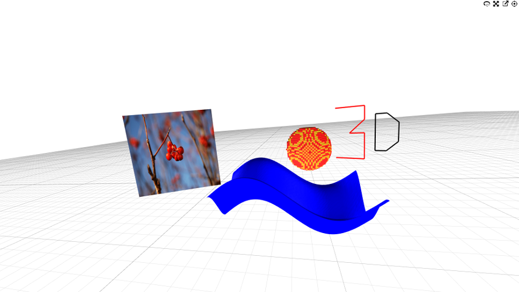

# K3D Jupyter

Jupyter notebook extension for 3D visualization.

## Try it Now!

## Installation

To install use pip:

    $ pip install k3d
    $ jupyter nbextension install --py --sys-prefix k3d
    $ jupyter nbextension enable --py --sys-prefix k3d

For a development installation (requires npm),

    $ git clone https://github.com/K3D-tools/K3D-jupyter.git
    $ cd K3D-jupyter
    $ pip install -e .
    $ jupyter nbextension install --py --symlink --sys-prefix k3d
    $ jupyter nbextension enable --py --sys-prefix k3d

## How to

Please make sure to take a look at the [HOW-TO.md](HOW-TO.md) document.
