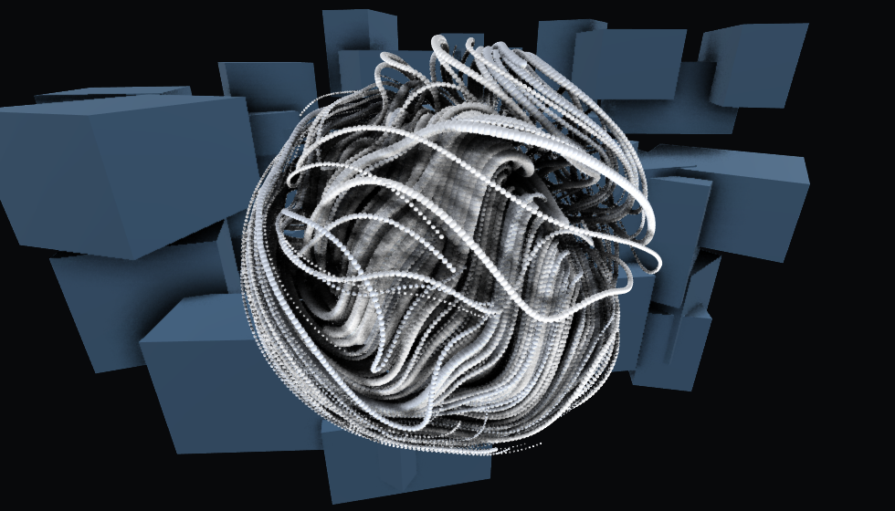
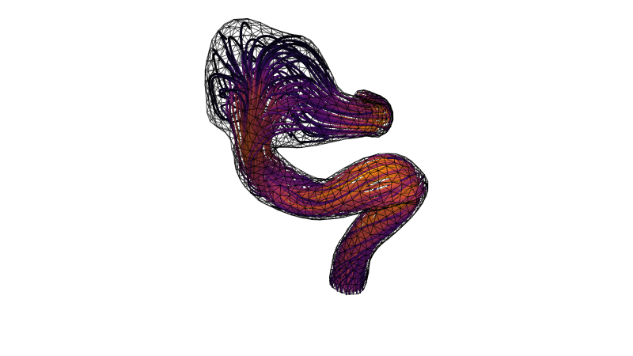

# K3D Jupyter

K3D lets you create 3D plots backed by WebGL with high-level API (surfaces, isosurfaces, voxels,
mesh, point clouds, vtk objects, volume renderer, colormaps, etc). The primary aim of K3D-jupyter is
to be easy to use as a standalone package like matplotlib, but also to allow interoperation with
existing libraries as VTK. K3D can be run as:

- Jupyter Notebook / JupyterLab widget (anywidget) 🚀
- Google Colab widget 🎉
- VS Code notebooks 🧩
- Standalone HTML/JS 📑

Since 3.0.0 a plot also chooses how it is lit, through `plot.renderer`: `simple` (the
default rasteriser), `advanced` (image-based lighting with ambient occlusion) or `cinematic`
(progressive path tracing). **`cinematic` is experimental** — it needs WebGL2 with renderable
float textures, does not cover every object (`volume_slice` is not drawn, volumes stay
outside the light simulation), and its API and output may still change; `simple` and
`advanced` are the stable choices. See
[Renderers](https://k3d-jupyter.org/user/renderers.html).

Documentation: [https://k3d-jupyter.org](https://k3d-jupyter.org)

## Showcase:

Two frames from the renderers 3.0.0 added, both produced by the code in this repository —
click either one for how it works.

`advanced`: image-based lighting and ambient occlusion. A million analytic sphere impostors,
with the occlusion in the crevices between strands doing the sculpting.

`cinematic`: progressive path tracing. 871k triangles read through VTK, 512 samples, lit only
by an environment map — the shadow under the belly and the light the floor throws back into
the flank are consequences of the simulation, not effects.

### YouTube:

Click to watch at YouTube:

## Try it Now!

Watch: [Interactive showcase gallery](https://k3d-jupyter.org/gallery/index.html)

Jupyter
version: 

## Installation

### PyPI

To install from PyPI use pip:

    $ pip install k3d

### Conda/Anaconda

To install from conda-forge use:

    $ conda install -c conda-forge k3d

### Google Colab

Since 3.0.0 (the anywidget migration) no extra steps are needed:

    !pip install k3d

`import k3d` and plot - custom widget activation and the text protocol
are no longer required.

### Installing directly from GitHub

To install directly from this repository (requires git and node.js + npm to build):

    $ pip install git+https://github.com/K3D-tools/K3D-jupyter

This also makes possible installing the most up-to-date development version (same requirements):

    $ pip install git+https://github.com/K3D-tools/K3D-jupyter@devel

To install any historical version, replace `devel` above with any tag or commit hash.

### Source

For a development installation (requires npm and node.js),

    $ git clone https://github.com/K3D-tools/K3D-jupyter.git
    $ cd K3D-jupyter
    $ pip install -e .

No separate JupyterLab extension step is needed - the widget ships its own
frontend module (anywidget).

### Code of Conduct

K3D-jupyter follows the Python Software Foundation Code of Conduct in everything we do.

## Kudos

- Jupyter is my ❤️
- OpenDreamKit is 🚀
- Three.js is 🥇

## Acknowledgments

<table class="none">
<tr>
<td>

</td>
<td>
Research Infrastructure project
This package was created as part of the Horizon 2020 European
<a href="https://opendreamkit.org/">OpenDreamKit</a>
(grant agreement <a href="https://opendreamkit.org/">#676541</a>).
</td>
</tr>
</table>

