Gallery
=======

.. k3d_plot ::
   :filename: lines.py
   :screenshot:

.. k3d_plot ::
   :filename: lorenz_attractor.py
   :screenshot:

.. k3d_plot ::
   :filename: platonic.py
   :screenshot:

.. k3d_plot ::
   :filename: points_cloud.py
   :screenshot:

.. image:: lines.png
   :target: lines.html

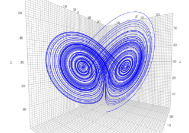

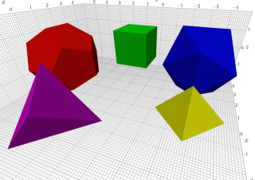

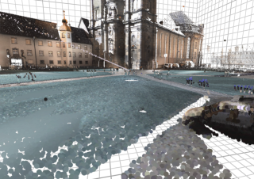

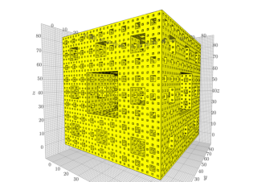

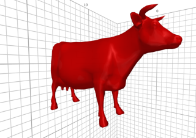

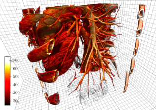

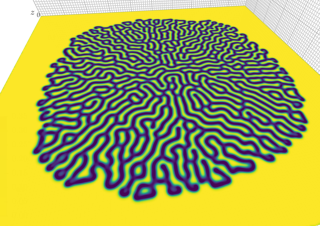

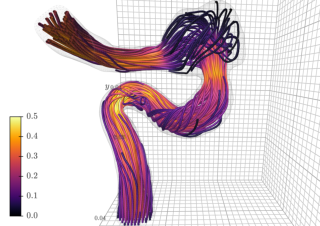

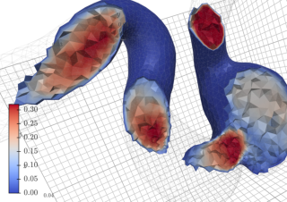

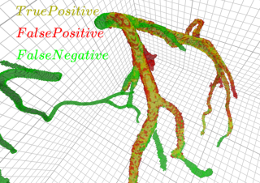

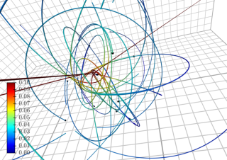

.. toctree::
   :glob:
   :hidden:

   lines
   lorenz_attractor
   platonic
   points_cloud
   sierpinski3d
   VTK_polydata
   volume
   gray_scott
   streamlines
   VTK_cutter
   segmentation_preview
   nbody
